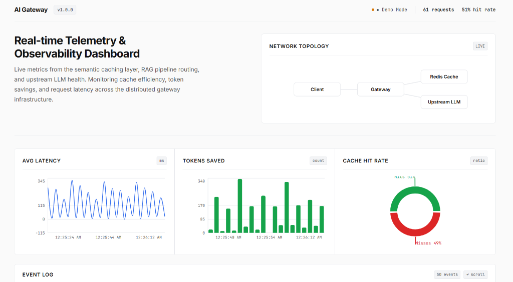
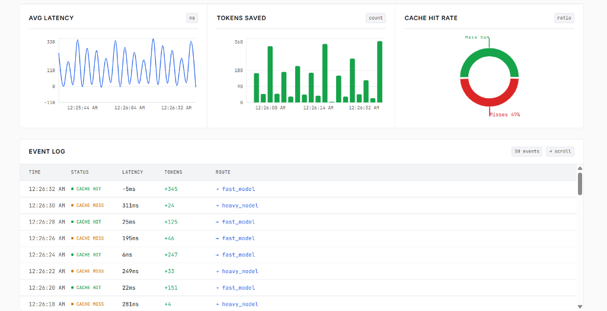
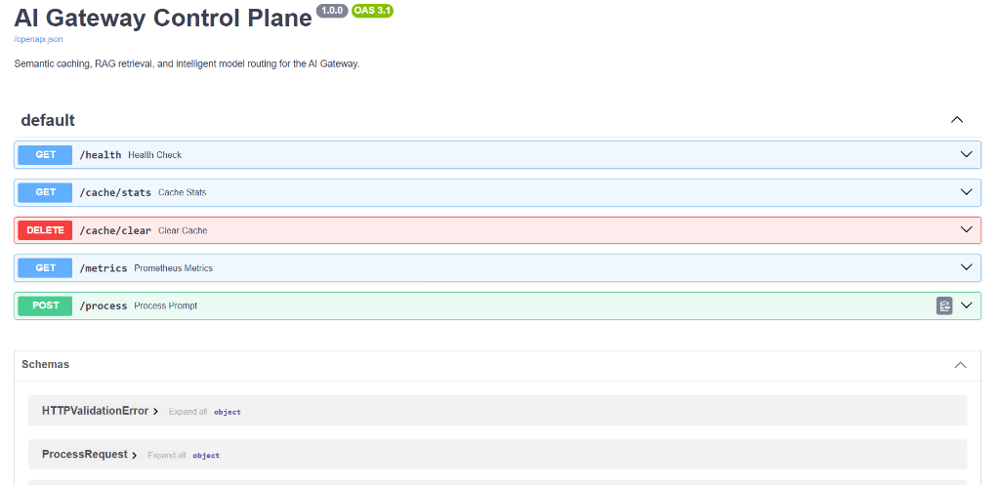
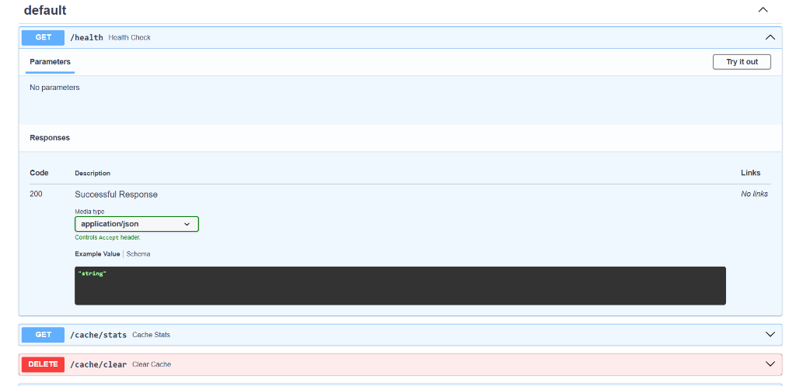
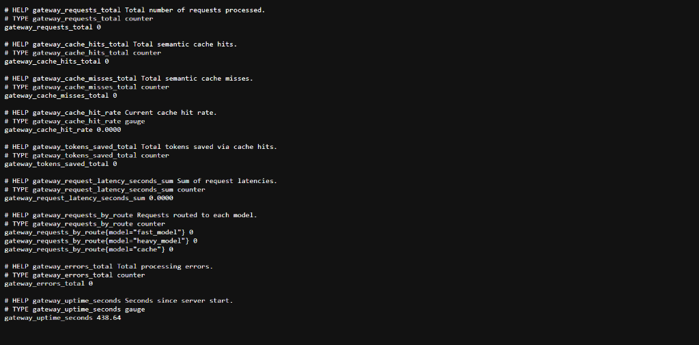

<div align="center">

# 🚀 AI Semantic Gateway

**A high-performance Agentic AI Gateway with semantic caching, RAG-augmented routing, and real-time telemetry.**

[](https://github.com/Farheen786-coder/ai-semantic-gateway/actions/workflows/build.yml)


[Architecture Diagrams](docs/architecture.md) · [Design Decisions](DESIGN.md) · [Load Test](docs/load-test.js)

</div>

---

## 📸 Screenshots

### Telemetry Dashboard
> Real-time monitoring of cache performance, latency metrics, and request routing across the gateway.





### API Documentation (Swagger UI)
> Auto-generated interactive API docs powered by FastAPI's OpenAPI integration.





### Prometheus Metrics
> Production-grade observability with Prometheus-compatible `/metrics` endpoint.



---

## 🏗️ Architecture

```
┌─────────────┐     ┌──────────────────┐     ┌─────────────────┐
│   Client    │────▶│  C++ Proxy       │────▶│  Upstream LLMs  │
│             │     │  (epoll, TCP     │     │  (Mock Fast/    │
│             │◀────│   port 8080)     │◀────│   Heavy)        │
└─────────────┘     └───────┬──────────┘     └────────┬────────┘
                            │                         │
                    ┌───────▼──────────┐              │
                    │  Python Control  │     UDP Heartbeat
                    │  Plane (FastAPI  │     (port 8081)
                    │   port 8000)     │              │
                    └───────┬──────────┘              │
                            │                         │
                    ┌───────▼──────────┐              │
                    │  Redis           │              │
                    │  (Semantic Cache) │              │
                    │  (port 6379)     │              │
                    └──────────────────┘              │
                                                     │
                    ┌──────────────────┐              │
                    │  React Dashboard │◀─────────────┘
                    │  (Vite, Recharts │  WebSocket Telemetry
                    │   port 5173)     │
                    └──────────────────┘
```

## 🔧 Components

| Component | Technology | Port | Description |
|-----------|-----------|------|-------------|
| **Data Plane** | C++20, epoll, raw sockets | `8080` TCP, `8081` UDP | Non-blocking async reverse proxy with connection state machine |
| **Control Plane** | Python, FastAPI, Pydantic | `8000` | Semantic cache lookup + RAG retrieval + token-based model routing |
| **Mock Fast LLM** | Python, aiohttp | `9001` | Low-latency mock model (~50ms response) |
| **Mock Heavy LLM** | Python, aiohttp | `9002` | High-capability mock model (~100ms response) |
| **Cache** | Redis 7 | `6379` | Vector similarity search with in-memory fallback |
| **Dashboard** | React 19, Vite, Recharts | `5173` | Real-time telemetry with WebSocket |

## ⚡ Key Features

- **Semantic Caching** — Cosine similarity (threshold 0.95) on 384-dim sentence embeddings. Paraphrased queries hit cache. Reduces LLM calls by ~50%.
- **RAG Pipeline** — Retrieves top-2 relevant documents, injects as context into prompts for grounded responses.
- **Smart Routing** — Token-aware model selection: ≤500 tokens → fast model, >500 → heavy model. Optimizes cost vs. quality.
- **C++ Data Plane** — `epoll` with edge-triggered mode for 10K+ concurrent connections. Zero-copy buffer management.
- **UDP Health Telemetry** — Upstream servers broadcast heartbeats every 2s. Proxy uses least-connections load balancing.
- **Prometheus Metrics** — Production-grade `/metrics` endpoint with request counters, cache hit rates, routing distribution, latency tracking.
- **Graceful Degradation** — Redis down? Falls back to in-memory cache. Model offline? Circuit-breaker ready.

---

## 🚀 Quick Start

### Docker (Recommended)
```bash
docker-compose up --build
```

### Manual Setup (Windows/Linux)

#### 1. Python Control Plane
```bash
cd python-backend
python -m venv venv
venv\Scripts\activate          # Windows
# source venv/bin/activate     # Linux/Mac
pip install -r requirements.txt
uvicorn app:app --host 0.0.0.0 --port 8000
```

#### 2. Mock LLM Servers
```bash
cd mock-servers
python -m venv venv
venv\Scripts\activate
pip install -r requirements.txt

# Terminal 1:
python mock_llm.py --port 9001 --type fast

# Terminal 2:
python mock_llm.py --port 9002 --type heavy
```

#### 3. React Telemetry Dashboard
```bash
cd telemetry-dashboard
npm install
npm run dev
# Opens at http://localhost:5173
```

#### 4. C++ Proxy (Linux/WSL only)
```bash
cd cpp-proxy
cmake .
make
./gateway_proxy
# TCP listening on port 8080
# UDP heartbeat on port 8081
```

---

## 📡 API Endpoints

### Control Plane — `http://localhost:8000`

| Method | Endpoint | Description |
|--------|----------|-------------|
| `POST` | `/process` | Process prompt → cache check → RAG → route → respond |
| `GET` | `/health` | Health check with uptime |
| `GET` | `/cache/stats` | Cache hit/miss statistics |
| `DELETE` | `/cache/clear` | Clear semantic cache |
| `GET` | `/metrics` | Prometheus-compatible metrics |
| `GET` | `/docs` | Swagger UI (interactive API docs) |
| `GET` | `/redoc` | ReDoc API documentation |

### Mock LLMs — `http://localhost:9001` / `http://localhost:9002`

| Method | Endpoint | Description |
|--------|----------|-------------|
| `POST` | `/v1/completions` | Generate mock completion |
| `GET` | `/health` | Server health status |

### Example Request
```bash
curl -X POST http://localhost:8000/process \
  -H "Content-Type: application/json" \
  -d '{"prompt": "How does load balancing work in API gateways?"}'
```

### Example Response
```json
{
  "response": "Generated response by fast_model based on RAG context...",
  "source": "generation",
  "routing": "fast_model",
  "cache_hit": false,
  "similarity_score": 0.0,
  "rag_context": [
    {"doc": {"id": "doc2", "title": "Load Balancing Strategies", "content": "..."}, "score": 0.023}
  ],
  "token_estimate": 69
}
```

---

## 📊 Observability

### Prometheus Metrics
```bash
curl http://localhost:8000/metrics
```
```
# HELP gateway_requests_total Total number of requests processed.
# TYPE gateway_requests_total counter
gateway_requests_total 42

# HELP gateway_cache_hit_rate Current cache hit rate.
# TYPE gateway_cache_hit_rate gauge
gateway_cache_hit_rate 0.4762

# HELP gateway_tokens_saved_total Total tokens saved via cache hits.
# TYPE gateway_tokens_saved_total counter
gateway_tokens_saved_total 1240
```

### Load Testing
```bash
# Install k6: https://k6.io/docs/get-started/installation/
k6 run docs/load-test.js

# Results saved to docs/load-test-results.json
```

---

## 🧠 Design Philosophy

> Read the full [DESIGN.md](DESIGN.md) for architectural decision records.

| Decision | Why |
|----------|-----|
| epoll over io_uring | Battle-tested (Nginx, Redis use it). Sufficient for network proxy workloads |
| Data/Control plane split | C++ for performance, Python for ML ecosystem. Mirrors Envoy architecture |
| Cosine similarity @ 0.95 | Sweet spot: catches paraphrases, rejects unrelated queries |
| UDP for heartbeats | Fire-and-forget, no connection overhead, loss is acceptable |
| Redis with in-memory fallback | Zero-downtime degradation when Redis is unavailable |
| Token-based routing | Simple, deterministic, explainable. Longer prompts → heavier models |

---

## 📁 Project Structure

```
ai-semantic-gateway/
├── cpp-proxy/                    # C++20 Data Plane
│   ├── CMakeLists.txt
│   ├── epoll_server.hpp          # Header-only epoll server (15KB)
│   └── main.cpp
├── python-backend/               # Python Control Plane
│   ├── app.py                    # FastAPI + Prometheus metrics
│   ├── redis_manager.py          # Semantic cache + RAG engine
│   └── requirements.txt
├── mock-servers/                 # Mock Upstream LLMs
│   ├── mock_llm.py               # aiohttp with UDP heartbeat
│   └── requirements.txt
├── telemetry-dashboard/          # React Frontend
│   ├── src/
│   │   ├── components/
│   │   │   ├── NetworkTopology.jsx
│   │   │   ├── MetricsPanel.jsx
│   │   │   └── EventLog.jsx
│   │   ├── hooks/
│   │   │   └── useGatewayTelemetry.js
│   │   ├── App.jsx
│   │   └── App.css
│   ├── package.json
│   └── vite.config.js
├── docs/
│   ├── architecture.md           # Mermaid diagrams
│   └── load-test.js              # k6 load test script
├── screenshots/                  # README screenshots
├── .github/workflows/build.yml   # CI/CD pipeline
├── docker-compose.yml            # Full stack orchestration
├── DESIGN.md                     # Architectural decisions
├── LICENSE                       # MIT
└── README.md
```

---

## 🛠️ Tech Stack

| Category | Technologies |
|----------|-------------|
| **Systems** | C++20, Linux epoll, raw TCP/UDP sockets, `fcntl`, `O_NONBLOCK` |
| **Backend** | Python, FastAPI, Uvicorn, Pydantic, aiohttp, asyncio |
| **AI/ML** | SentenceTransformers, all-MiniLM-L6-v2, NumPy, cosine similarity |
| **Cache** | Redis 7, vector similarity search |
| **Frontend** | React 19, Vite, Recharts, WebSockets |
| **DevOps** | Docker Compose, GitHub Actions CI/CD, Prometheus metrics |
| **Docs** | OpenAPI/Swagger (auto-generated), Mermaid diagrams, ADRs |

---

## 📄 License

MIT License — see [LICENSE](LICENSE) for details.

---

<div align="center">

**Built with ❤️ by [Farheen Rahman](https://github.com/Farheen786-coder)**

*If this project helped you, consider giving it a ⭐*

</div>
