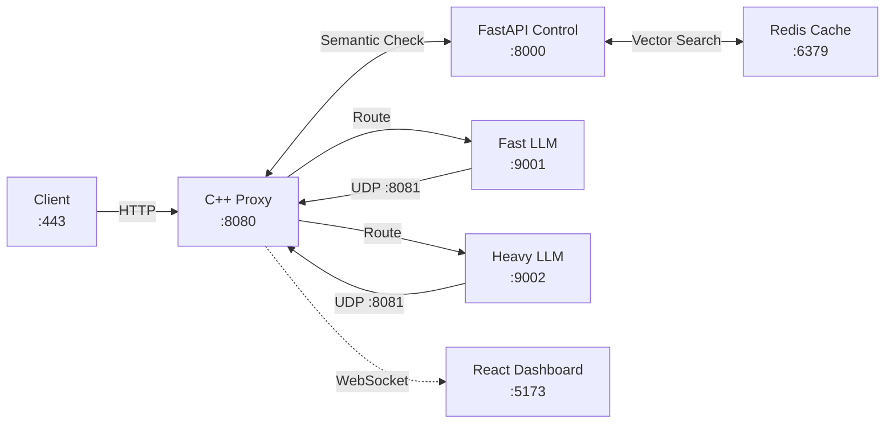
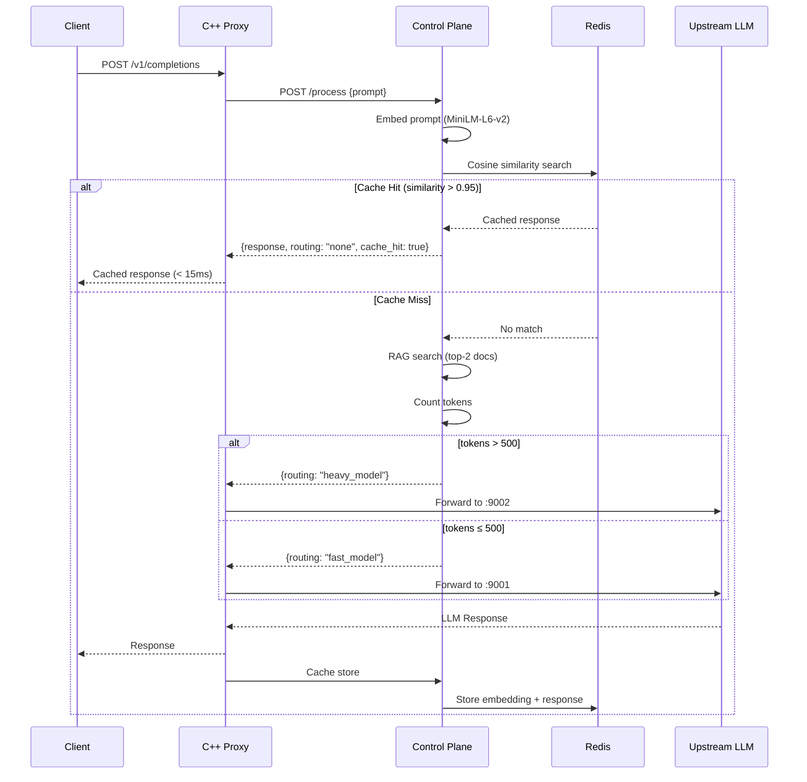
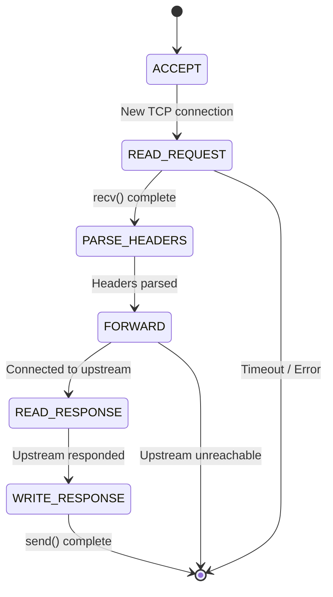

# Architecture

## System Overview



## Request Flow



## Connection State Machine (C++ Proxy)



## UDP Heartbeat Protocol

```
Every 2 seconds, each upstream sends:
┌─────────────────────────────────────────────┐
│ UDP Datagram → 127.0.0.1:8081              │
│                                             │
│ {                                           │
│   "port": 9001,                             │
│   "active_requests": 3,                     │
│   "type": "fast",                           │
│   "timestamp": 1695000000.0                 │
│ }                                           │
└─────────────────────────────────────────────┘

Proxy uses this for least-connections load balancing.
Stale heartbeats (>10s) mark upstream as unhealthy.
```

## Data Flow Summary

| Layer | Technology | Responsibility |
|-------|-----------|----------------|
| Data Plane | C++20, epoll | Non-blocking TCP proxy, UDP health receiver, connection state machine |
| Control Plane | Python, FastAPI | Semantic embedding, cache lookup, RAG retrieval, model routing |
| Cache | Redis | Vector similarity storage, prompt-response cache |
| Upstream | aiohttp | Mock LLM completion API, latency simulation |
| Frontend | React, Recharts | Real-time WebSocket telemetry visualization |
